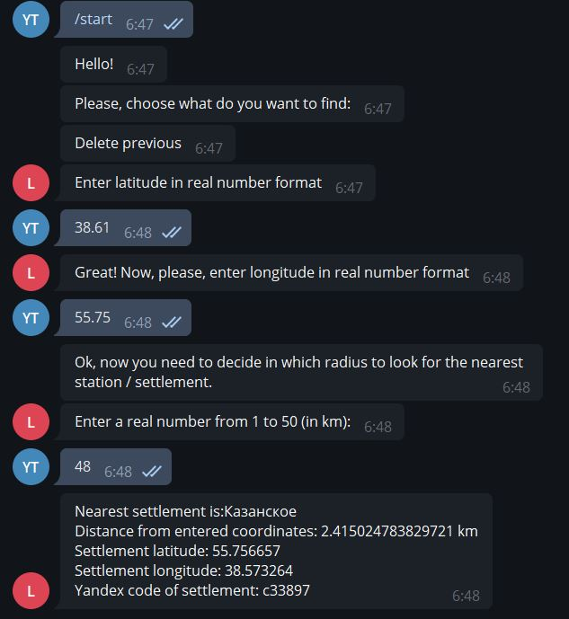

# Telegram Bot

This project is a client-server application, where the telegram bot acts as the client, 
and the django server acts as the server.

# Start working with bot

You can contact the bot in the telegram application by link @LocationFounderBot.

# Operating modes

Bot can process two tasks:

+ Find the closest city to a point on the map
+ Find the nearest transport stations to the selected point on the map (limit of nearest objects - 5)

Coordinates are entered in the format (Latitude, Longitude),  after this you can enter your radius in which to
search for objects

# Interaction with bot

Bot only processes two input commands:

+ /help
+ /start

Command /help tells you how to start working with the bot in coordinate search mode.
By the command / start, the bot gives you options for searching for objects (described in the paragraph above)

# Иллюстрация диалога с ботом

